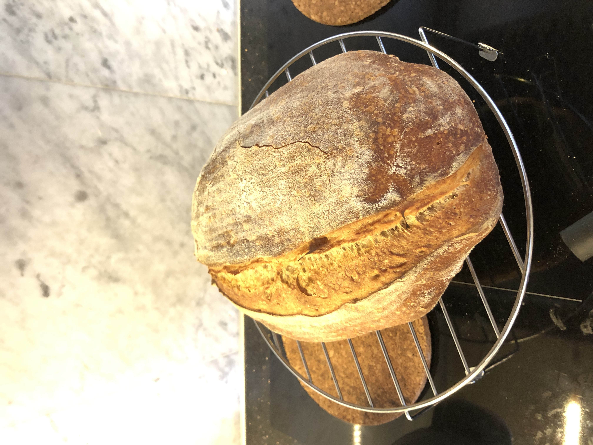

## Standardrecept
https://www.bakewithjack.co.uk/blog-1/2018/7/5/sourdough-loaf-for-beginners
https://foodgeek.dk/en/artisan-sourdough-bread-recipe-an-easy-recipe-for-crispy-bread/

## Bread calculator
https://foodgeek.dk/en/bread-calculator/

### Testa att göra denna:
https://www.youtube.com/watch?v=0Z3ae1vPNQ0

## Bakers percentages (går att ha andra)
    100% flour
    2% salt
    80% vatten - kanske mindre om startern är blöt
    20-25% starter enligt nån sida. Går nog att variera ganska mycket.

    Blanda allt utom starter och salt = autolyse (man verkar kunna blanda i salt utan att det påverkar)

## Bröddagbok
### 45. 21-08-13 - 21-08-14 - 70% vatten, 1 bröd ingen knådning, bara formning för formen! Vilade över natten
    300 g vete spec
    200 g vete spec fullkorn
    350 g water
    120 g sourdough starter
    10 g salt

    Lät den ligga i stor glaslåda med lock från typ 10:10 till 13:50 då degen vuxit med ungefär 70-80%. Ca 24 C i rummet. Ingen vikning av något slag.

    Gjorde preshape, vilade degen i ca 30 min och sen en final shape till en batard 
    Jäste över natten i kylen från ca 14:30 till ca 8. Jäste jättemycket i kylen och blev nästan ingen oven spring.
    Körde stora grytan som lock. Värmde sten, gryta och ugn till 280 C i 50 min och sen in med brödet i 20 min och sen sänkte jag till 200 grader och körde i 20 min till utan lock.

### 44. 21-08-09 - 21-08-08 - ca 75% vatten, 1 bröd ingen knådning! Blev överjäst, så jag la det i avlång form. Vilade över natten i kylen.
    300 g vete spec
    200 g vete spec fullkorn
    363 g water
    124 g sourdough starter (100 % hydration)
    10 g salt

    Matade startern på kvällen innan. Den hade jäst bra över natten. Satte igång med degen typ 10:00, fick jäsa i glaslåda fram till XX.XX ovanför kylen (ca 28 C). Ingen vikning av något slag. Rätt varmt i rummet.

    Gjorde preshape, men det fungerade inte. Var nog överjäst, så jag la det i en avlång form.
    Jäste över natten i kylen från ca 15:00 till ca 9:00.
    Ingen gryta som lock. Värmde sten och ugn till 280 C i 50 min och sen sänkte jag till 245 C i 20 och sen 200 i minst 20 min utan lock (glömde bort tiden på slutet).

    Ser ut att ha blivit fin. Nästan ingen oven spring.

### 43. 21-08-06 - 21-08-07 - 70% vatten, 1 bröd ingen knådning, bara formning för formen! Vilade över natten
    286 g vete spec
    214 g vete spec fullkorn
    350 g water
    137 g sourdough starter
    10 g salt

    Matade startern på förmiddagen. Det var rätt lite aktivitet i startern när jag la i den, men jag fick ont om tid. Satte igång med degen typ 16:30, fick jäsa i glaslåda fram till 21.00. Ingen vikning av något slag. Rätt varmt i rummet.
    Gjorde preshape, vilade degen i ca 20 min och sen en final shape till en batard.
    Jäste över natten i kylen från 21:30 till 11:30.
    Körde stora grytan som lock. Värmde sten, gryta och ugn till 280 C i 50 min och sen sänkte jag till 245 C i 20 och sen 200 i 20 utan lock.

    Inget bra resultat. Den hade behövt jäsa mycket längre. Felet var förmodligen att startern var för trött. Kanske hade kunnat hjälpas genom att den fått jäsa längre i kylen.

### 42. Oklart datum, tidig sommar tror jag. Gjorde samma som 41 och sen i ugn hos Marja. Fick jäsa för länge och blev sisådär.

### 41. 21-05-29 - 21-05-30 - 70% vatten, 2 bröd ingen knådning, bara formning för formen! Vilade över natten
    600 g vete spec
    400 g vete spec fullkorn
    700 g water
    240 g sourdough starter
    20 g salt

    Lät den ligga i stor glaslåda med lock från typ 14:00 till 19:00. Ingen vikning av något slag. Rätt kallt i rummet fram till 18, sen ganska varmt pga ugnspannkaka.
    Gjorde preshape, vilade degen i ca 30 min och sen en final shape till en batard 
    Körde stora grytan som lock. Värmde sten, gryta och ugn till 280 C i 50 min och sen sänkte jag till 245 C i 20 och sen 200 i 20 utan lock.

### 40. 21-05-27 - 21-05-28 - 70% vatten, 1 bröd ingen knådning, bara formning för formen! Vilade över natten
    300 g vete spec
    200 g vete spec fullkorn
    350 g water
    120 g sourdough starter
    10 g salt

    Lät den ligga i stor glaslåda med lock från typ 14:00 till 19:00. Ingen vikning av något slag. Rätt kallt i rummet fram till 18, sen ganska varmt pga ugnspannkaka.
    Gjorde preshape, vilade degen i ca 30 min och sen en final shape till en batard 
    Körde stora grytan som lock. Värmde sten, gryta och ugn till 280 C i 50 min och sen sänkte jag till 245 C i 20 och sen 200 i 20 utan lock.

    Autolyse 1 timme med alla ingredienser  - Vila över natten
    650 g vete spec
    150 g vete spec fullkorn
    540 g water
    200 g sourdough starter
    16 g salt

    Körde stora grytan som lock. Värmde sten, gryta och ugn till 280 C och sen sänkte jag till 245 C i 20 och sen 200 i 20 utan lock.

### 38. 21-03-07 - 21-03-08 - 70% vatten, 1 bröd + 2 baguetter (hälften så mycket deg som brödet)
    Autolyse 1 timme med alla ingredienser  - Vila över natten
    650 g vete spec
    150 g vete spec fullkorn
    540 g water
    200 g sourdough starter
    16 g salt

    Körde stora grytan som lock. Värmde sten, gryta och ugn till 280 C och sen sänkte jag till 245 C i 20 och sen 200 i 20 utan lock.

### 37. 21-02-20 - 21-02-21 Autolyse 1 timme bröd 70% vatten - Vila över natten
    650 g vete spec
    150 g vete spec fullkorn
    540 g water
    200 g sourdough starter
    16 g salt

    Körde stora grytan som lock. Värmde sten, gryta och ugn till 280 C och sen sänkte jag till 245 C i 20 och sen 200 i 20 utan lock.

### 36. 21-01-22 - 21-01-23 Autolyse 1 timme bröd 70% vatten - Vila över natten
    650 g vete spec
    150 g vete spec fullkorn
    540 g water
    160 g sourdough starter
    16 g salt

    Stoppade in i kylen 17:15, tog ut ut den ur kylen igen klockan:

    Råkade jäsa typ 40-50% istället för 25% innan pre-shape

### 35. 21-01-09 Autolyse 1 timme bröd 70% vatten - BLEV BRA!
    650 g vete spec
    150 g vete spec fullkorn
    536 g water
    160 g sourdough starter
    15 g salt

    245 C i 20 min + 200 C i 20 min. (260 C var för varmt)
    https://foodgeek.dk/en/artisan-sourdough-bread-recipe-an-easy-recipe-for-crispy-bread/

### 34. 21.01.04-21.01.05- Autolyse över natten Ett bröd 80% vatten - BLEV EN KLADDIG GEGGA TILL DEG
    400 g vete spec (100 g fullkorn)
    300 g vatten + ca 10 g vatten till saltet
    Autolyse över natten tillsammans med starten
    8 g salt
    ca 100 g rågsurdegsstart

    80% hydration med allt
    vek varje halvtimme i typ 4 timmar sen vila typ 1 timme

### 33. 20.12.27. - lite blötare standarddeg
    800 g vete spec
    645 g vatten
    17 g salt
    ca 200 g rågsurdegsstart
    Rumtemp 21.5 C
    (Dough hydration: 82.8%)

### 32. 20.11.14. - 
    1000 g vete spec och veta spec med fullkorn (300g)
    ca 610 g vatten
    50 g rapsolja
    20 g salt
    ca 240 g rågsurdegsstart

    15-20 MINUTER blev jättebra.
    Gjorde 9 frallor som vägde ca 200-230g styck. Kan nog halveras.

### 31. 20.10.23. - TRE BRÖD
    1200 g vete spec och veta spec med fullkorn (400g)
    ca 780 g vatten
    24 g salt
    ca 220 g rågsurdegsstart

### 30. 20.10.12. Danskt rågbröd!
    https://foodgeek.dk/en/danish-rye-bread-recipe/

    Moddade receptet så det blev som nedanstående

    280g starter(100% hydration)
    300g water(75.0%)
    400g rye flour(100.0%)
    20g salt(5.0%)
    330g cracked rye kernels(82.5%)
    170g pumpkin seeds(42.5%)
    50g malt syrup(12.5%) - Tog mörk sirap

    Smöra två avlånga glasformarna. Häll i degen och platta till. Låt jäsa tills det vuxit 30-50%. Tumregel, vänta tills det kommit 5-7 knapphuvudsstora små hål på degen. Tog typ 4 timmar för mig, men det var nog lite för långt.

    Varmluftsugn 220 C i 10 min, sen 165 C i "40-70 minutes until the breads internal temperature is 98°C". Efter 10+40 min var den 99 C i min ugn.

    Låt det svalna och när det svalnat så förvara det i plastpåse så att skorpan blir mjuk

### 29. 20.10.04. - Marjas vedeldade ugn
    800 g vete spec och veta spec med fullkorn (300g)
    520 g vatten
    16 g salt
    ca 215 g rågsurdegsstart

### 28. 20.09.22. - TRE BRÖD
    1200 g vete spec och veta spec med fullkorn (300g)
    ca 780 g vatten
    24 g salt
    ca 220 g rågsurdegsstart

### 27. 20.08.17. - 
    1000 g vete spec och veta spec med fullkorn (300g)
    ca 675 g vatten
    20 g salt
    ca 200 g rågsurdegsstart

### 26. 20.08.17. - 
    1000 g vete spec och veta spec med fullkorn
    ca 650 g vatten
    20 g salt
    ca 200 g rågsurdegsstart

### 24. 20.08.02. - 
    1000 g vete spec och veta spec med fullkorn
    ca 650 g vatten
    20 g salt
    ca 200 g rågsurdegsstart
    värm ugn till 250 C och sen sänk till 200 när allt åker in. I ugnen ca 50 min. Blev jättefint. Tog av locket på grytan efter ca 30.

### 24. 20.07.29. - En sandwich breads och en rund i formen, så att det kanske kan bli så fint som hos Henrik
    1000 g vete spec
    ca 700 g vatten
    20 g salt
    ca 200 g rågsurdegsstart
    200 C i ugnen tills klar ca 50 min

    Note: glasgrytan är lite för liten för 500 g vetemjöls-deg

### 23. 20.07.07. - Foccacia (mindre nästa gång. Kanske 500 g mjöl)
    800 g vetemjöl special
    640 g vatten (80%)
    24 g olivolja (3%)
    24 g salt (3%)
    160 g start (20%) - Tog lite mer
    230 C i 20 minuter (inte varmluftsugn). Behövdes lite mer än så. Typ 5-10 min extra.

    Update - blev superlöst och blev inte bättre med tiden, så jag la i mer mjöl. Några stora puffar.
### 22. 20.06.25. - Två sandwich breads
    1000 g vete spec
    ca 750 g vatten
    20 g salt
    ca 200 g rågsurdegsstart
    200 C i ugnen tills klar ca 40 min

### 21. 20.06.04. Två sandwich breads
    1000 g vete spec
    ca 670 g vatten
    18 g salt
    ca 220 g rågsurdegsstart
    200 C i ugnen tills klar

### 20. 20.05.23. Två sandwich breads
    1000 g vete spec
    ca 700 g vatten
    20 g salt
    ca 250 g rågsurdegsstart
    200 C i ugnen tills klar

### 18-19. 20.05.15-20.05.15. 
    - Ett sandwhich bread i from. 500 g v.mjöl spec. ca 100 g rågstart, 350 g vatten, 10 g salt. 

    - Brioche hamburger buns.
    https://www.youtube.com/watch?v=WnvgWm-ILBg&t=68s
    https://www.akneadtobake.com/post/sourdough-brioche-hamburger-buns
    Receptet som finns i länkarna, men instället för att det vilar i kylen 6 timmar i början så lät jag det jäsa på bänken i 2,5 h typ och sen i kylen 1,5 timme. Jäste sen typ 2-3 timmar i bullform. Blev jättebra!

### 17. 20.05.11-20.05.12. 
    Stegen följde typ länken men körde 600 g istället. Lite kortare jäsning på dagen eftersom att det var varmare hos mig än hos honom. Jäste över natten. Jäste kortare i bulken, men nästa gång behöver jag jäsa ännu mindre.
    https://www.bakewithjack.co.uk/blog-1/2018/7/5/sourdough-loaf-for-beginners
    Video: https://www.youtube.com/watch?v=vmb0wWKITBQ&t=166s

### 16. 20.05.08-20.05.09. 
    Stegen följde typ länken. Lite kortare jäsning på dagen eftersom att det var varmare hos mig än hos honom. Jäste över natten.
    https://www.bakewithjack.co.uk/blog-1/2018/7/5/sourdough-loaf-for-beginners
    Video: https://www.youtube.com/watch?v=vmb0wWKITBQ&t=166s
    Blev jättebra!

### 15. 20.05.07-20.05.07. Bröd gjort på vetemjöl, och lite rågmjöl med jäst. 
    Det här receptet. https://www.youtube.com/watch?v=UlaXqK7C67g.
    Hade 35 g olja istället för 30.
    Behövde vara inne lite längre i ugnen
    Blev superfina :)

### 14. 20.04.27-20.04.27.
    510 g vetemjöl spec. 90 g vetemjöl spec. med fullkorn, 12 g salt, 
    Autolys typ 1 timme. 30 min vila, 12 vikningar, ca 1 h vila, 12 vikningar, 1,5 h vila (lite osäker på tiden), 6 vikningar, 1 h, 6 vikningar. shaping vila typ 30, shaping, jäsa typ 4 timmar. 
    230 grader 15 minuter, 190 grader 25 minuter.
    Kanske blev överjäst. Testa att jäsa mindre under vikningarna nästa gång. Kanske värmen i badrummet som gör att den jäst för fort.
    Här diskuteras liknande problem där många pratar om att det kan vara "overproofed": http://www.thefreshloaf.com/node/29414/loaf-falling-immediately-after-scoring

### 13. 20.04.23-20.04.23. Pizzadeg!
    540 g vetemjöl special. Typ 180 g rågstart, 10 g salt, 50 g olivolja. Typ 320 g vatten. 1 g jäst. Knåda länge tills den blev bra och glutenig. 
    30min jäs, fold, 30min jäs, fold, 30 jäsmin, fold, jäsa 2 timmar.
    Dela till 4 bollar. Forma och lät dem jäsa på olivolja mellan två plåtar (en som lock)
    300 grader på baksten 5 minuter
    Ta mer mjöl nästa gång! Den höll inte ihop så bra.

### 12. 20.04.21-20.04.21. 
    Stegen följde typ länken men jag hade typ 40 min autolyse först. 
    https://www.bakewithjack.co.uk/blog-1/2018/7/5/sourdough-loaf-for-beginners
    Video: https://www.youtube.com/watch?v=vmb0wWKITBQ&t=166s
    Blev jättebra, men jag skar eventuellt för djupt.
    Testa 600 g nästa gång

### 11. 20.04.18-20.04.19. 
    Stegen följde typ länken men jag hade typ 40 min autolyse först. 
    https://www.bakewithjack.co.uk/blog-1/2018/7/5/sourdough-loaf-for-beginners
    Video: https://www.youtube.com/watch?v=vmb0wWKITBQ&t=166s
    510 g mjöl, varav 350 vetemjöl special med fullkorn, 160 vetemjöl special. 377 g vatten. 100 g rågsurdeg. 
    30 min vänta, ca 12 vikningar, 2 h, ca 12 vikningar (skulle visst varit färre enligt receptet, jag pressade ut luften vilket kanske var ett misstag), 6 vikningar, 1 h vila (2 h i receptet), pre-shape, 1 h vila, in i korgen.
    Jäsa hela natten i kylen.

### 10. 20.04.16-20.04.16. Bröd gjort på vetemjöl med jäst. 
    Det här receptet. https://www.youtube.com/watch?v=UlaXqK7C67g.
    Hade 35 g olja istället för 30.
    Behövde vara inne lite längre i ugnen
    Blev superfina :)

### 9. 20.04.13-20.04.14. Sandwich bread. 
    Följde det här receptet https://foodgeek.dk/en/sourdough-sandwich-bread-recipe/#wprm-recipe-container-33898
    Gjorde halv sats och ersatte  mjölk med sojamjölk (Alpro). Penslade med vatten. Inget socker
    Hade i lite mer vetestarter (100g)
    Blev alldeles för blöt.
    Fick först slutjäsa 2,5 på golvet i badrummet sen jäsa över natten
    Blev inge bra. Jäste aldrig. Fick nästan ingen oven spring. Vet inte riktigt varför.

### 8. 20.04.09-20.04.09. Sandwich bread. 
    Följde det här receptet https://foodgeek.dk/en/sourdough-sandwich-bread-recipe/#wprm-recipe-container-33898
    Gjorde halv sats och ersatte smör och mjölk med margarin och sojamjölk (Alpro). Penslade med vatten.
    Hade i lite mer vetestarter (100g)

### 7. 20.04.07-20.04.07. 
    500 g vetemjöl special med fullkorn, 350 g vatten (70%), autolyse med salt (10g), 125 g vetestart. Vila 30, fold, vila 30, fold, vila 30, fold, jäsa i badrummet 2,5 h (lite mer, sista stående på värmegolvet). Preshape, vänta 30, preshape igen, för första blev inte så bra tror jag, vänta 20, sen shape och in i korgen. Sen jäsa 3,5 h i badrummet. 260 grader i 50 minuter. Föst med lock i 30, sen 15 utan lock.
    - Nästa gång ska jag eventuellt ha lite svalare i ugnen mot slutet. Kanske preheat till 260 men sen ta ner till 230 på en gång. Den blev lite för bränd

### 6. 20.04.03-20.04.04. 
    300 g vetemjöl special, 100 g grahamsmjöl, 300 g vatten (75%), Autolyse 1,5 h, 9 g salt, ca 100 g vetestart, knåda tills windowpane är bra, jäsa från förmiddag till kväll, forma, vänta 20, forma och lägg i jäskorg, jäsa över natten. In i ugnen! 260 g uppvärmning, 30 min med lock, sänk värmen till 230, 20 utan lock.

### 5. 20.04.01-20.04.01. 
    230 g vetemjöl special, 170 g grahamsmjöl, 300 g vatten (75%), Autolyse 1 h, 9 g salt, ca 100 g vetestart, knåda tills windowpane är bra, jäsa 3,5 h (gjorde en stretch and fold efter ca 2 timmar), forma, vänta 30, forma och lägg i jäskorg, jäsa 3,5 h. In i ugnen! 230 g uppvärmning, 25 min med lock, 25 utan lock.

### 4. 20.03.28-20.03-29. 
    Ungefär 300 g vetemjöl special, 100 g grahamsmjöl, 300 g vatten, 9 g salt, ca 100 g rågstart. Autolyse 1 h, knåda tills windowpane är bra, jäsa 3,5 h, forma, vänta 30, forma och lägg i jäskorg, jäsa 3,5 h. In i ugnen! 40 minuter. 260 g uppvärmning, sänkte till 230 g när brödet åkte in. Med ånga. Var inne i 40 min. Bra men kunde varit mer jäsning i ugnen

### 3. 20.03.24-20.03.26. 
    200 g vetemjöl special
    200 g grahamsmjöl
    320 g vatten
    8 g salt 
    100 g rågstart. 
    Fyra coil folds med 30 min mellan, sen 2 timmar jäsa. 

### 2. 20.03.20-20.03.21. 
    Patrick Ryan seed bread - frön, + lite mer mjöl. Bra, men kunde ha jäst mer i ugnen. Rågstart.

### 1. Typ 20.03.17-20.03.18. 
    Låta bli blir också bra (två bröd). Rågstart. För platt.

