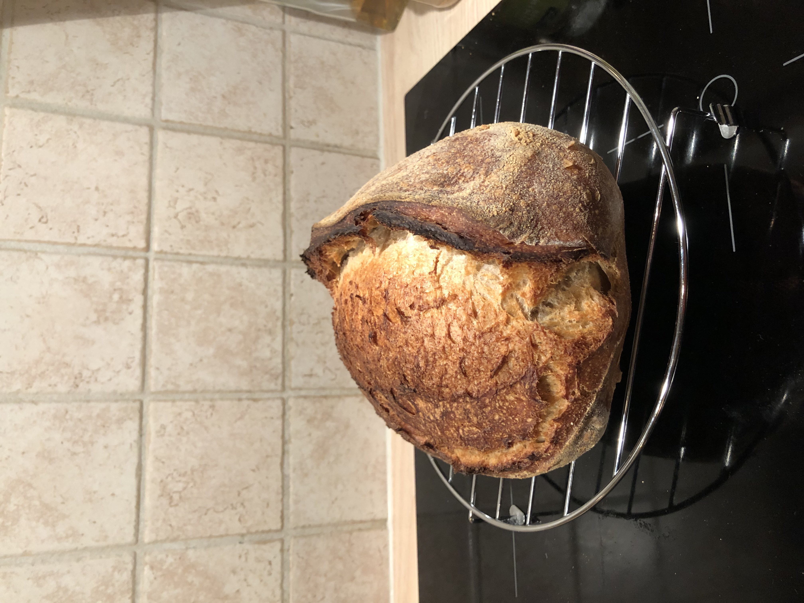

## Day 1: Feeding sourdough starter
### Feeding the starter during the evening day 1
Add 70 g of water and 70 g of flour to the starter. Let it rest over night in room temperature.

## Day 2: Mixing, fermenting and shaping
### Mixing the ingredients
- 300 g bread flour (Vetemjöl special)
- 200 g full grain bread flour (vetemjöl special fullkorn)
- 350 g water
- ca 130 g sourdough starter
- 10 g salt

### Bulk ferment
Approximatly 4 hours. After ca 1 hour i did 3 stretch and folds with 30 minutes in between each set.

### Shaping
Maybe dont pre-shape since you're only making one bread. Pour the dough directly onto a floured work space. Then shape it and put it in the floured banneton. Fold the two sides onto itself and then roll then dough into its final shape.

### Proofing
Approximatly 6 hours. Proofed in fridge from 14:00 to 20:00.

### Scoring the bread
Score the bread with a razor.

### Steam
Spray the dough with water before putting the lid over the dough.

### Oven temperature 

Heated the oven to 250&deg;C (482&deg;F) with heat from bottom and top, not using the fan. I heated tha dutch oven at the same time as the oven. I then lowered the temp to 230&deg;C The bread first cooked with the dutch oven for 20 minutes and then for another 20 minutes. 230deg;C through the whole bake.

### Result
The spring was great, but lower the temperature to 200&deg;C for the last 20 minutes next time. The crust got a little too dark.

