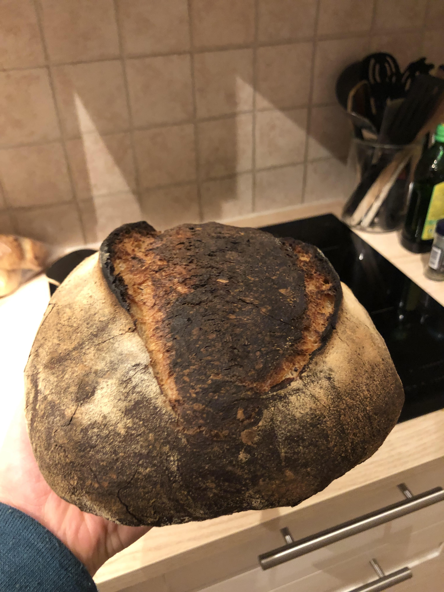

## Day 1: Feeding sourdough starter
### Feeding the starter during the evening day 1
Add 60 g of water and 60 g of flour to the starter. Let it rest all day in room temperature.

## Day 2: Do the rest
### Mixing the ingredients
- 325 g bread flour (Vetemjöl special)
- 100 g full grain bread flour (vetemjöl special fullkorn)
- 100 g spelt (dinkel)
- 415 g water 
- ca 100 g sourdough starter
- 10 g salt

### Bulk ferment
Approximatly 5 hours (ca 8:30 to 13:30). After ca 1 hour i did 3 stretch and folds. I then forgot about the though and did two more with 20 minutes apart sometime around 12. The bulk was too long, I should probably aim at 4 hours.

### Shaping
Poured the dough directly onto a floured work space and then shaped it and put it in the floured banneton. Folded the two sides onto itself and then roll then dough into its final shape.

### Proofing
Approximatly 5 hours. Proofed in fridge from ca 13:30 to 18:30.

### Scoring the bread
A straight slightly angled cut on top.

### Steam
No extra spraying of water or anything like that. It worked out great

### Oven temperature 

Heated the oven to 250&deg;C (482&deg;F) with heat from bottom and top, not using the fan. I heated tha dutch oven at the same time as the oven. I then forgot to lower the temp so the bread was burnt. :/

### Result
Okay, but I burned it because I forgot to lower the temp. 

