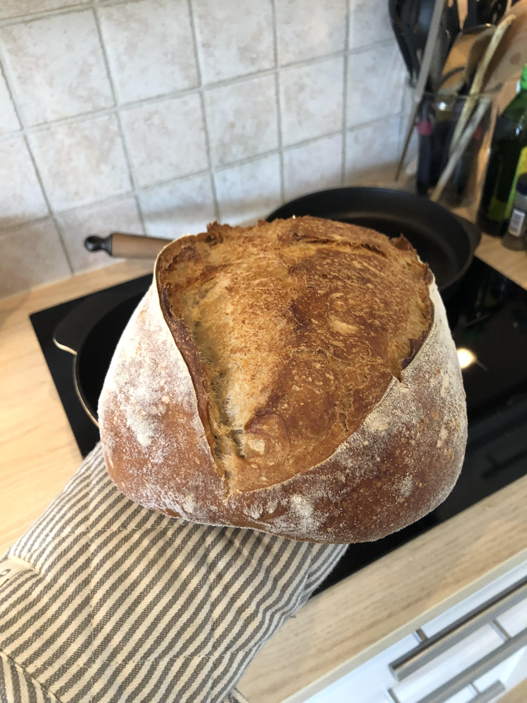

## Day 1: Feeding sourdough starter
### Feeding the starter during the evening day 1
Add 70 g of water and 70 g of flour to the starter. Let it rest all day in room temperature.

## Day 2: Do the rest
### Mixing the ingredients
- 250 g bread flour (Vetemjöl special)
- 150 g full grain bread flour (vetemjöl special fullkorn)
- 100 g spelt (dinkel)
- 390 g water 
- ca 100 g sourdough starter
- 10 g salt

### Bulk ferment
Approximatly 4.5 hours (ca 9:30 to 14:00). After ca 2 hour i did 3 stretch and folds with ca 30 minutes in between each set.
Room temperature ca. 21&deg;C (69&deg;F.

### Shaping
Poured the dough directly onto a floured work space and then shaped it and put it in the floured banneton. Folded the two sides onto itself and then roll then dough into its final shape.

### Proofing
Approximatly 18 hours. Proofed in fridge from ca 14:00 to 8:00.

### Scoring the bread
A straight simple cut

### Steam
No extra spraying of water or anything like that. It worked out great

### Oven temperature 

Heated the oven to 250&deg;C (482&deg;F) with heat from bottom and top, not using the fan. I heated tha dutch oven at the same time as the oven. I then lowered the temp to 230&deg;C The bread first baked with the dutch oven for 20 minutes and then lowed the temperature to 200&deg;C and baked the bread for another 20 minutes. 230deg;C through the whole bake.

### Result
Great! 

