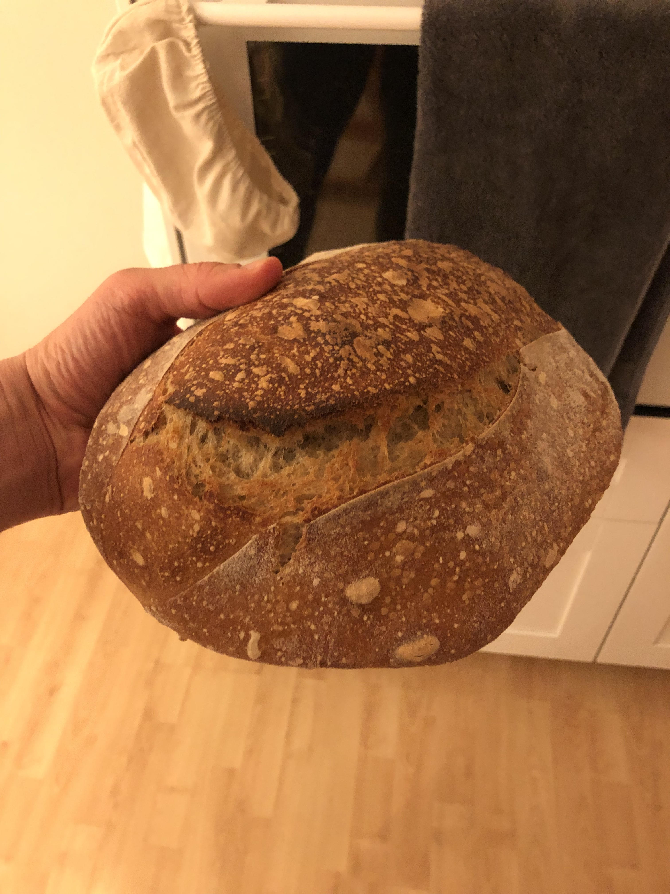

## Day 1: Feeding sourdough starter
### Feeding the starter during the evening day 1
Add 60 g of water and 60 g of flour to the starter. Let it rest all day in room temperature.

## Day 2: Do the rest
### Mixing the ingredients (80% hydration)
- 300 g bread flour (Vetemjöl special)
- 200 g spelt (dinkel)
- 390 g water 
- ca 100 g sourdough starter (100% hydration)
- 10 g salt

### Bulk ferment
Approximatly 4 hours (ca 6:50 to 11:00). After ca 1 hour i did 3 stretch and folds with ca 1 hour in between each set.
Room temperature ca. 21&deg;C (69&deg;F.

### Shaping
Poured the dough directly onto a floured work space and then shaped it and put it in the floured banneton. Folded the two sides onto itself and then roll then dough into its final shape.

### Proofing
Approximatly 8 hours. Proofed in fridge from ca 11:10 to 19:10.

### Scoring the bread
A straight simple cut

### Steam
No extra spraying of water or anything like that. It worked out great

### Oven temperature 

Put the bread in the oven inside the dutch oven, while the oven is cold. Heat the oven to max temp, 250&deg;C (482&deg;F) in my case. Leave it there for 30 minutes, than remove the dutch oven lid. Bake for another  

### Result
Terrible. Did not work at all. The bread still tasted good though.

